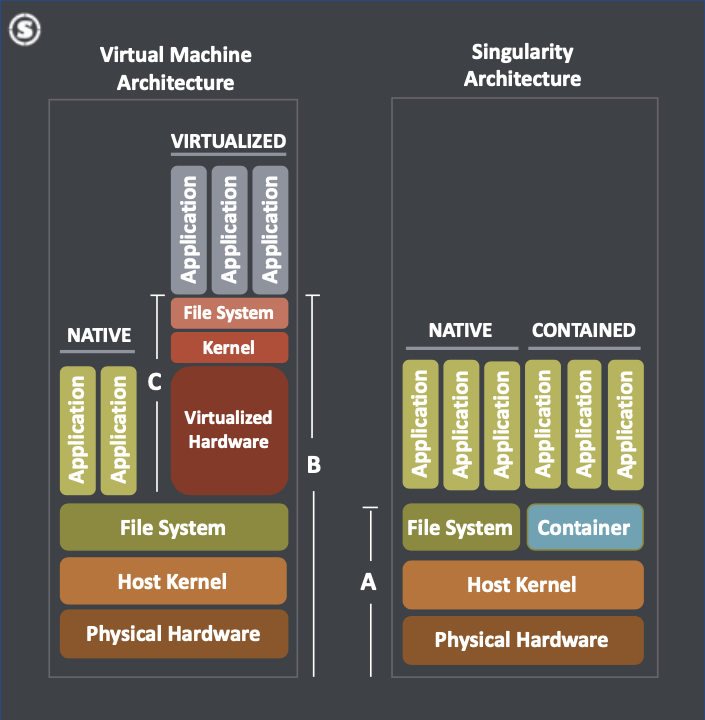

## Outline

1 --- Overview of software containers  
2 --- Getting pre-built container images  
3 --- Building custom container images  
4 --- Running container images


## 1 --- Overview of software containers


## What are software containers?

- Isolated, secure, stable, portable, and reproducible software environments
- Packages main application and all dependencies
- OS-level virtualization
- Provides a custom user space
- Different from a virtual machine
  - Containers have direct access to the kernel
  - Virtual machines have indirect access (performance penalty)


## Singularity containers

- A container format designed for shared HPC systems
- Most popular container format for HPC
- Can be isolated from or integrated with host system
- Singularity vs. Docker
  - Docker requires superuser privileges to run container images
  - Superuser privileges not available on shared HPC systems
  - Can convert from Docker to Singularity format


## Singularity architecture



Source: [Singularity Community and SingularityPRO on high-performance servers](https://sylabs.io/assets/white-papers/Sylabs_Whitepaper_High_performance_server_v3.pdf)


## Why use Singularity for research?

- Install anything you want (based on any Linux OS)
- Ease installation issues by using pre-built container images
- Ensure reproducible software environments
- Ensure the same software stack is used among a research group
- Ensure the same software stack is used across Linux systems (e.g., any HPC center)
- Run the same workflows across Linux systems by embedding runscripts in container images


## Some specific Singularity use cases

- Converting Docker images to Singularity images
- Using applications that need older or cutting-edge or very specific versions of software
- Bundling complex software stacks for easier distribution
- Using proprietary software (typically distributed as binaries) that depends on other software not available on host system


## Some limitations of Singularity

- Built for Linux systems
- Portability depends on a few factors
  - CPU architecture format (x86 vs. ARM)
  - Binary format (ELF)
  - Kernel, glibc, other API compatibility
- Not always backwards compatible
- Need superuser privileges to build images


## The container image

- A single, compressed, read-only image file (executable `.sif`)
- Bundles application and all software dependencies needed to run it
- Intended to be immutable
- If need to modify, rebuild
- A container is a running instance of a container image


## Getting and running images

- Getting images
  - Pull pre-existing images from container registries
  - Download images from software websites
  - Build your own custom image
- Running images
  - Run images in interactive or batch modes
  - Various options can be used to isolate/integrate with host system


## 2 --- Getting pre-built container images


## Pulling existing container images

- Pull from container registries
- [Singularity Cloud Library](https://cloud.sylabs.io/library)

```
singularity pull library://ubuntu:latest
```

- [Docker Hub](https://hub.docker.com/)

```
singularity pull docker://clearlinux:latest
```


## Exercise 1

Pull a container image from a registry


## 3 --- Building custom container images


## Building externally

- Need to build outside of CARC systems (requires superuser privileges)
- But need a Linux OS
- Can build in a sandbox mode or with a definition file (recipe)
- Best approach is to use the cloud-based [Singularity Remote Builder](https://cloud.sylabs.io/home)
- Or use a virtual machine on your local computer (e.g., [Multipass](https://multipass.run/), [Virtual Box](https://www.virtualbox.org/))
- Alternatively, create a Docker container image locally, upload to Docker Hub, and then convert to Singularity format


## Building workflow

1. Create a definition file
2. Build image externally using the definition file
3. If error occurs, modify definition file and rebuild (back to step 1)
4. Transfer image file to CARC systems
5. Test image
6. If error occurs, modify definition file and rebuild (back to step 1)


## Definition files

- Recipe for building a container image
- Start with a base Linux OS (e.g., Debian, Ubuntu, CentOS, Clear Linux)
- Or start with existing container image
- Then install software, add files, etc.
- Similar to a Dockerfile, but different syntax


## Structure of a definition file

```
# Header (required)

Bootstrap: ...
From: ...

# Sections (optional)

%files
    Copy files to the container from host (/source /destination)

%post
    Install software and libraries, write configuration files, download files from the internet, etc.

%test
    Run commands to validate build process

%environment
    Define environment variables that will be set at runtime

%startscript
    Run commands when singularity instance start command is used

%runscript
    Run commands when singularity run command is used    

%labels
    Add metadata labels (name-value pair)

%help
    Describe the container and its intended use
```


## Example definition file

```
Bootstrap: library
From: ubuntu:20.04

%post
    apt-get -y update
    apt-get -y upgrade
    apt-get -y install wget
    apt-get -y autoremove --purge
    apt-get -y clean
  
    cd /opt
    wget -q https://julialang-s3.julialang.org/bin/linux/x64/1.6/julia-1.6.3-linux-x86_64.tar.gz
    tar -xf julia-1.6.3-linux-x86_64.tar.gz
    rm julia-1.6.3-linux-x86_64.tar.gz

    mkdir /opt/juliadeot
    export JULIA_DEPOT_PATH=/opt/juliadepot
    /opt/julia-1.6.3/bin/julia -e 'using Pkg; Pkg.add("StatsKit")'

%test
    export PATH=/opt/julia-1.6.3/bin:$PATH
    julia --version

%environment
    export LC_ALL=C
    export PATH=/opt/julia-1.6.3/bin:$PATH
    export JULIA_DEPOT_PATH=/opt/juliadepot

%runscript
    julia

%help
    Ubuntu 20.04 with Julia 1.6.3 and the JuliaStats packages.
```


## Example definition file 2

```
Bootstrap: docker
From: clearlinux/r-base:4.1.1

%post
    Rscript -e 'install.packages("data.table", repos = c("https://cloud.r-project.org"))'

%test
    R --version

%environment
    export LC_ALL=C

%runscript
    R

%help
    Based on the Clear Linux r-base:4.1.1 Docker image. Base R 4.1.1 built with OpenBLAS. Packages installed: data.table
```


## Using Singularity Remote Builder

- [Singularity Container Services](https://cloud.sylabs.io/home) by [Sylabs](https://www.sylabs.io)
- Free service with up to 11 GB of storage
- Log in with other account (GitHub, GitLab, Google, Microsoft)
- Set up access token on CARC systems
- Use web GUI interface to build


## Using Singularity Remote Builder (continued)

- Can also build remotely from the command line
- Builds image remotely and automatically downloads to current directory

```
singularity build --remote julia.sif julia.def
```


## Exercise 2

Create a definition file for a custom container image  
Use the Remote Builder to build the custom image  
Transfer the image to CARC systems  
[Some template definition files](https://github.com/uschpc/singularity)


## 4 --- Running container images


## Three commands to run images

- `singularity shell` &mdash; for an interactive shell within the container
- `singularity exec` &mdash; for executing commands within the container
- `singularity run` &mdash; for running a pre-defined runscript within the container
- A container process is like any other Linux process
- Just a different software environment


## Examples

```
singularity shell julia.sif

singularity exec julia.sif julia -e 'println("Hello world")'

singularity run julia.sif

singularity inspect --runscript julia.sif
```

## Exercise 3

Run the command `echo 'Hello world'` within a container


## Bind mounting directories to containers

- Some directories are automatically mounted to the container
  - `/home1/<username>`
  - `/tmp` or `TMPDIR`
- Use the `--bind` option to mount additional directories
- For example, to add your current working directory and `/scratch` directory:

```
singularity exec --bind $PWD,/scratch/<username> julia.sif julia script.jl
```


## Other useful options

- Often a good idea to use `--cleanenv` (or shorter `-e`)
- May need to use `--no-home` to exclude `/home1` directory
  - e.g., for Python, R, Julia containers
  - Where packages are installed by default


## Exercise 4

Bind mount a `/project` directory to a container  
Show that it mounted correctly by listing files in that directory


## Running containers on GPUs

- Containers need to access host GPU driver
- Use `--nv` option to allow container access to driver
- Run `nvidia-smi` on GPU node to see current driver version and compatibility
- [GPU support docs](https://singularity.hpcng.org/user-docs/master/gpu.html)
- Example for TensorFlow runscript:

```
singularity run --cleanenv --nv tf.sif
```


## Running containers with MPI

- Two approaches: hybrid vs. mount
- Pros and cons for each approach
- Less portable
- [MPI support docs](https://singularity.hpcng.org/user-docs/master/mpi.html)
- Example for OpenMPI program:

```
srun --mpi=pmix_v2 -n $SLURM_NTASKS singularity exec openmpi.sif mpi_program
```


## Singularity environment variables

- Some useful environment variables can be set
- Add to `~/.bashrc` to automatically set every time you log in
- For example, change cache directory from `/home1` to `/scratch`:

```
export SINGULARITY_CACHEDIR=/scratch/<username>/.singularity
```

- For example, add certain bind paths to every container:

```
export SINGULARITY_BIND=/scratch/<username>,/project/<project_id>
```


## Example job script

```
#!/bin/bash

#SBATCH --nodes=1
#SBATCH --ntasks=1
#SBATCH --cpus-per-task=8
#SBATCH --mem=16GB
#SBATCH --time=1:00:00
#SBATCH --account=<account_id>

module purge

singularity exec julia.sif julia script.jl
```


## Singularity documentation

- [Official docs](https://singularity.hpcng.org/user-docs/master/)  

```
singularity help
```


## Additional resources

- [Using Singularity on CARC Systems](https://carc.usc.edu/user-information/user-guides/software-and-programming/singularity)
- [CARC Singularity template definition files](https://github.com/uschpc/singularities)
- [Singularity website](https://singularity.hpcng.org/)
- [Singularity documentation](https://singularity.hpcng.org/user-docs/master/)
- [Singularity tutorial](https://singularity-tutorial.github.io/)
- [Singularity Remote Builder](https://cloud.sylabs.io/home)
- [Singularity Cloud Library](https://cloud.sylabs.io/library)
- [Docker Hub](https://hub.docker.com/)
- [BioContainers](https://biocontainers.pro)
- [NVIDIA GPU Cloud Catalog](https://ngc.nvidia.com/catalog)


## CARC support

- [Submit a support ticket](https://carc.usc.edu/user-information/ticket-submission)
- [User Forum](https://hpc-discourse.usc.edu/)
- Office Hours
  - Every Tuesday 2:30-5pm
  - Register [here](https://carc.usc.edu/news-and-events/events)
